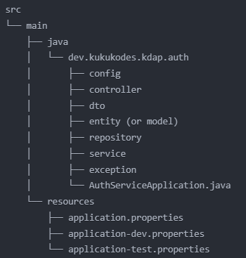

# Spring Configuration Methods

<details>
<summary><strong>Overview of Spring Configuration Approaches</strong></summary>

Spring Framework offers various ways to configure your application. Each method has its own use cases and benefits. Expand each section below to learn more about different configuration approaches.

<details>
<summary>1. Configuration via Java Beans</summary>

- Define configuration using Java classes annotated with `@Configuration` and `@Bean`.
- Allows you to create and configure beans programmatically within your application context.
- Provides type-safety and allows for more complex bean creation logic.
</details>

<details>
<summary>2. Configuration via Properties Files</summary>

- Specify configuration settings in external properties files (e.g., `application.properties` or `application.yml`).
- Define application-specific settings that can be injected into Spring beans.
- Easily manageable and environment-specific configurations.
</details>

<details>
<summary>3. Profile-Based Configuration</summary>

- Use profiles to provide different configurations for different environments.
- Define beans or configuration settings specific to a profile using annotations like `@Profile` or profile-specific property files (e.g., `application-dev.properties`).
- Allows for easy switching between development, testing, and production configurations.
</details>

<details>
<summary>4. Configuration through Environment Variables</summary>

- Configure Spring applications using environment variables.
- Environment variables can override properties defined in `application.properties` or `application.yml`.
- Useful for cloud deployments and keeping sensitive information out of source control.
</details>

<details>
<summary>5. Conditional Configuration</summary>

- Use annotations like `@ConditionalOnProperty`, `@ConditionalOnClass`, or `@ConditionalOnBean` to conditionally include or exclude configuration based on certain conditions.
- Enables creating flexible and adaptive configurations.
</details>

<details>
<summary>6. Dynamic Configuration</summary>

- Use the `ConfigurableApplicationContext` interface to register and unregister beans dynamically.
- Useful for changing configuration at runtime.
- Allows for more flexible and adaptable applications.
</details>

<details>
<summary>7. Multiple Configuration Sources</summary>

- Combine multiple configuration sources, such as properties files and Java-based configuration.
- Spring will merge these configurations based on their precedence.
- Provides flexibility in organizing and managing configurations.
</details>

<details>
<summary>8. Configuration via Spring Boot Starter Dependencies</summary>

- Use starter dependencies that come with predefined configurations and settings.
- Simplifies the setup of common scenarios and reduces the need for manual configuration.
- Enables rapid application development with sensible defaults.
</details>

</details>


# Security Flow in Spring WebFlux for Custom Basic Auth with Hardcoded UserDetailsService
<details>
<summary>1. Initial Request</summary>

The client sends a request to a secured endpoint with Basic Auth credentials (username and password) in the Authorization header.
</details>

<details>
<summary>2. ServerHttpSecurity Configuration</summary>

Your custom `SecurityWebFilterChain` bean, configured in the `SecurityConfig` class, intercepts the request:

```java
@Bean
public SecurityWebFilterChain securityWebFilterChain(ServerHttpSecurity http) {
    return http
        .authorizeExchange(exchanges -> exchanges
            .pathMatchers("/public/**").permitAll()
            .anyExchange().authenticated()
        )
        .httpBasic(withDefaults())
        .authenticationManager(reactiveAuthenticationManager())
        .build();
}
```
</details>

<details>
<summary>3. Authentication Filter</summary>

The `AuthenticationWebFilter` (part of the filter chain) extracts the Basic Auth credentials from the request header.
</details>

<details>
<summary>4. ReactiveAuthenticationManager</summary>

The filter passes the credentials to your custom `ReactiveAuthenticationManager`:

```java
@Bean
public ReactiveAuthenticationManager reactiveAuthenticationManager() {
    return authentication -> {
        String username = authentication.getName();
        String password = authentication.getCredentials().toString();
        
        return userDetailsService().findByUsername(username)
            .filter(userDetails -> passwordEncoder().matches(password, userDetails.getPassword()))
            .switchIfEmpty(Mono.error(new BadCredentialsException("Invalid credentials")))
            .map(userDetails -> new UsernamePasswordAuthenticationToken(
                userDetails, password, userDetails.getAuthorities()));
    };
}
```
</details>

<details>
<summary>5. ReactiveUserDetailsService</summary>

The `ReactiveAuthenticationManager` calls the `findByUsername` method of your hardcoded `ReactiveUserDetailsService`:

```java
@Bean
public ReactiveUserDetailsService userDetailsService() {
    UserDetails user = User.withUsername("user")
        .password(passwordEncoder().encode("password"))
        .roles("USER")
        .build();

    return new MapReactiveUserDetailsService(user);
}
```
</details>

<details>
<summary>6. Password Comparison</summary>

The `ReactiveAuthenticationManager` uses the `PasswordEncoder` to compare the provided password with the stored (encoded) password:

```java
@Bean
public PasswordEncoder passwordEncoder() {
    return new BCryptPasswordEncoder();
}
```
</details>

<details>
<summary>7. Authentication Result</summary>

- If the credentials are valid, a new `UsernamePasswordAuthenticationToken` is created with the user details and authorities.
- If invalid, a `BadCredentialsException` is thrown.
</details>

<details>
<summary>8. Security Context</summary>

If authentication is successful, the `SecurityContextHolder` is updated with the authenticated `Authentication` object.
</details>

<details>
<summary>9. Authorization Check</summary>

Spring Security checks if the authenticated user has the necessary authorities to access the requested resource.
</details>

<details>
<summary>10. Request Processing</summary>

- If authorized, the request proceeds to the intended endpoint.
- If not authorized, a 403 Forbidden response is sent.
</details>

<details>
<summary>11. Response</summary>

The response is sent back to the client, either with the requested resource or an error status.
</details>

<details>
<summary>Key Points</summary>

1. **Basic Auth**: Credentials are sent in the Authorization header of each request.
2. **Hardcoded UserDetailsService**: Using `MapReactiveUserDetailsService` with a single hardcoded user.
3. **Reactive Paradigm**: Every step returns a `Mono` or `Flux`, maintaining the non-blocking nature of WebFlux.
4. **Custom Authentication Logic**: `ReactiveAuthenticationManager` orchestrates the process of validating credentials.
5. **Password Encoding**: Always use a `PasswordEncoder` (BCrypt in this example) for secure password storage and comparison.
6. **Error Handling**: Basic error handling is included, but more comprehensive handling is recommended for production.
7. **Authorization**: Spring Security handles authorization based on user authorities and configured access rules.
8. **Stateless Nature**: Each request is authenticated independently, typical for RESTful APIs.
</details>

### Database Design for Role-Based Authentication

<details>
  <summary><strong>1. Users Table</strong></summary>

- UserID (Primary Key)
- Username
- Email
- PasswordHash
- UserDescription
- CreatedAt
- UpdatedAt
- LastLoginAt
- AccountStatus (e.g., active, suspended)
- EmailVerified (boolean)

</details>

<details>
  <summary><strong>2. Roles Table</strong></summary>

- RoleID (Primary Key)
- RoleName
- RoleDescription
- CreatedAt
- UpdatedAt

</details>

<details>
  <summary><strong>3. UserRoles Table (Junction table for many-to-many relationship)</strong></summary>

- UserRoleID (Primary Key)
- UserID (Foreign Key to Users)
- RoleID (Foreign Key to Roles)

</details>

<details>
  <summary><strong>4. Policies Table</strong></summary>

- PolicyID (Primary Key)
- PolicyName
- PolicyDescription
- CreatedAt
- UpdatedAt

</details>

<details>
  <summary><strong>5. RolePolicies Table (Junction table for many-to-many relationship)</strong></summary>

- RolePolicyID (Primary Key)
- RoleID (Foreign Key to Roles)
- PolicyID (Foreign Key to Policies)

</details>

<details>
  <summary><strong>6. Operations Table</strong></summary>

- OperationID (Primary Key)
- OperationName
- OperationDescription
- CreatedAt
- UpdatedAt

</details>

<details>
  <summary><strong>7. PolicyOperations Table (Junction table for many-to-many relationship)</strong></summary>

- PolicyOperationID (Primary Key)
- PolicyID (Foreign Key to Policies)
- OperationID (Foreign Key to Operations)

</details>


# Project structure Standards

# Image of Securiry filter

You will need to know this to implement your custom auth logic

# Bugs and issues
## Clean maven and download dependencies if everything is valid but doesn't work

CSRF token importance   
https://www.youtube.com/watch?v=8QDORHQvdu

<br>
For operations we need to first get authenticated as an admin by logging in as an admin


So the way we can create database is by create connection factory bean
then we can initialize it as needed by creating another bean connection factory initializer. i run my scripts here
