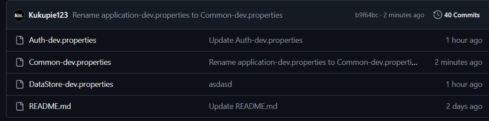
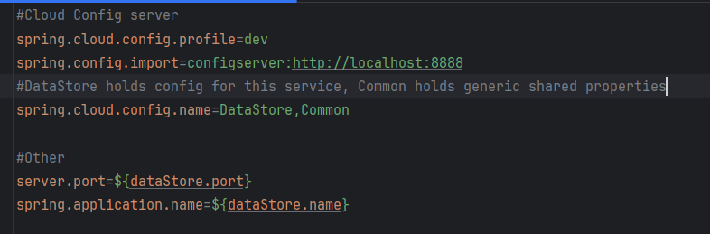

# About
Config server provides a central repository to store configurations for all applications.
Common properties can be shared along with per application property.


The naming convention is ```<appName-profile.properties>```

<br>
For a client to load multiple properties they have to list the names of the property files in their local properties configuration

